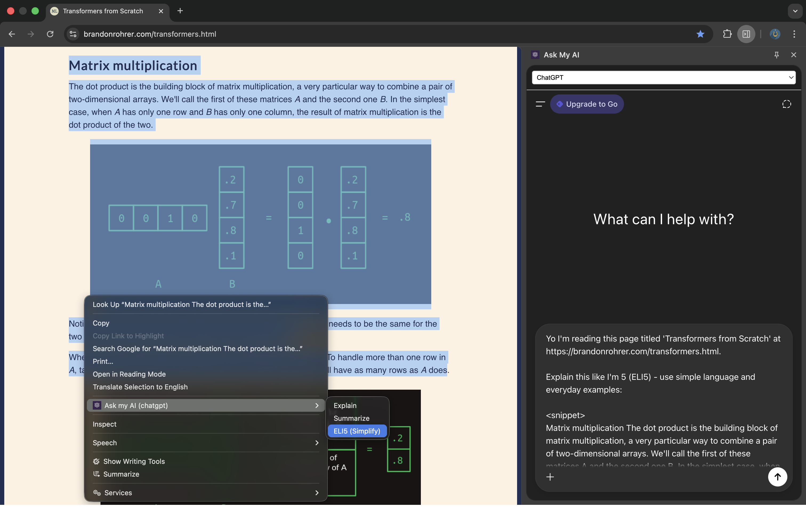

# Ask My AI

A Chrome extension that lets you instantly send selected text to your favorite AI for explanation with just a right-click.



## What it does

- **Right-click any text** → Select "Ask My AI" from context menu
- **Automatically opens sidebar** with your preferred AI (ChatGPT, Claude, Gemini, etc.)
- **Instantly sends your selected text** with context for explanation
- **No copy-pasting needed** - streamlines your workflow

Perfect for quickly understanding complex concepts, code snippets, technical terms, or any text you encounter while browsing.

## Why Use Ask My AI?

**Uses YOUR existing AI accounts** - no separate login or payment needed:

- ✅ **Your custom instructions** are preserved - AI responds how you prefer
- ✅ **Your conversation history & memories** stay intact
- ✅ **Your existing subscription** - completely free extension, just for convenience
- ✅ **No data collection** - works directly with your AI accounts

## Installation

### Option 1: From Chrome Web Store

[Add to Chrome](https://chromewebstore.google.com/detail/ask-my-ai/clfbemdacihopdopaanknckjkgbpando) from Chrome Web Store.

### Option 2: Load as Unpacked Extension (Developer Mode)

1. **Download or clone** this repository to your computer
2. **Install dependencies** - Run `pnpm install` in the project directory
3. **Build the extension** - Run `pnpm build` to compile TypeScript and bundle with Vite
4. **Open Chrome** and go to `chrome://extensions/`
5. **Enable Developer Mode** (toggle in top-right corner)
6. **Click "Load unpacked"** button
7. **Select the `dist` folder** from the project directory
8. **Done!** The extension is now installed

> **Note:** After making code changes, run `pnpm build` again and click the refresh icon on the extension card in `chrome://extensions/`

## How to Use

1. **Select any text** on a webpage
2. **Right-click** to open context menu
3. **Click "Ask My AI"**
4. **Sidebar opens** with your AI ready to explain the selected text
5. **Get instant explanations** without leaving your current page

## Supported AI Platforms

- ChatGPT (chatgpt.com)
- Claude (claude.ai)
- Gemini (gemini.google.com)
- Scira AI (scira.ai)
- DeepSeek Chat (chat.deepseek.com)
- Mistral Le Chat (chat.mistral.ai)
- Google (since it now has AI mode)
- xAI's Grok

## Settings

Click the extension icon in your toolbar to choose your preferred AI platform.

### Icons from

https://lobehub.com/icons

### Convert

```
cd images
magick ss.png -resize 1280x800! -quality 100 ss-resized.jpg
```
