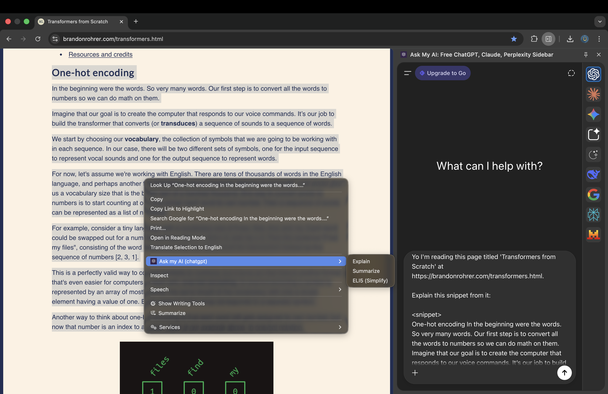

# Ask My AI

A Chrome extension that lets you instantly send selected text to your favorite AI for explanation with just a right-click.

## What it does

- **Right-click any text** → Select "Ask My AI" from context menu
- **Automatically opens sidebar** with your preferred AI (ChatGPT, Claude, Gemini, etc.)
- **Instantly sends your selected text** with context for explanation
- **No copy-pasting needed** - streamlines your workflow

Perfect for quickly understanding complex concepts, code snippets, technical terms, or any text you encounter while browsing.

## Why Use Ask My AI?

**Uses YOUR existing AI accounts** - no separate login or payment needed:

- ✅ **Your custom instructions** are preserved - AI responds how you prefer
- ✅ **Your conversation history & memories** stay intact
- ✅ **Your existing subscription** - completely free extension, just for convenience
- ✅ **No data collection** - works directly with your AI accounts

## Installation

### Option 1: Load as Unpacked Extension (Developer Mode)

1. **Download or clone** this repository to your computer
2. **Open Chrome** and go to `chrome://extensions/`
3. **Enable Developer Mode** (toggle in top-right corner)
4. **Click "Load unpacked"** button
5. **Select the extension folder** (the one containing `manifest.json`)
6. **Done!** The extension is now installed

### Option 2: From Chrome Web Store

_Coming soon - extension will be published to Chrome Web Store_

## How to Use

1. **Select any text** on a webpage
2. **Right-click** to open context menu
3. **Click "Ask My AI"**
4. **Sidebar opens** with your AI ready to explain the selected text
5. **Get instant explanations** without leaving your current page

## Supported AI Platforms

- ChatGPT (chatgpt.com)
- Claude (claude.ai)
- Perplexity (perplexity.ai)
- Google Gemini (gemini.google.com)
- Scira AI (scira.ai)
- DeepSeek Chat (chat.deepseek.com)

## Settings

Click the extension icon in your toolbar to choose your preferred AI platform.
